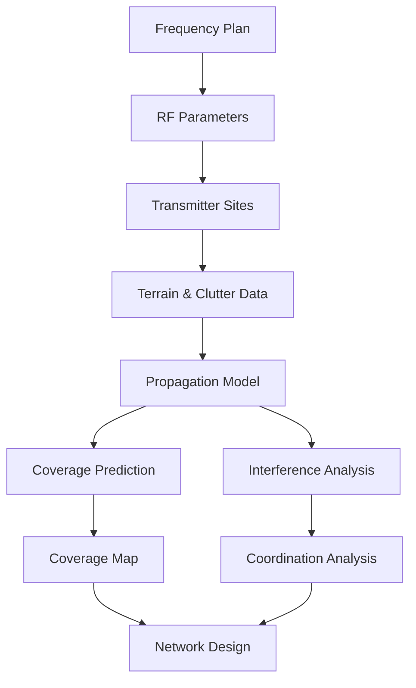
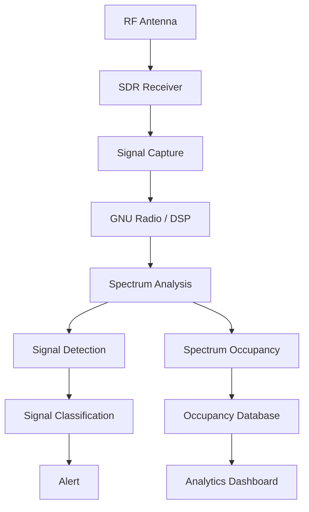
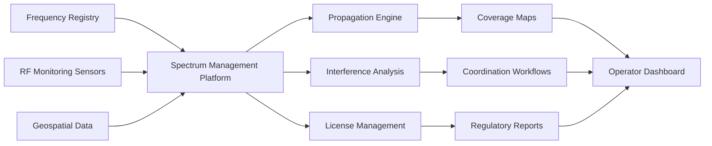
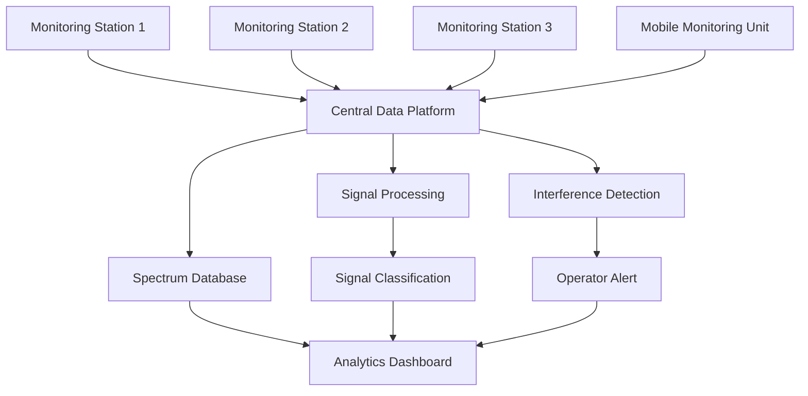
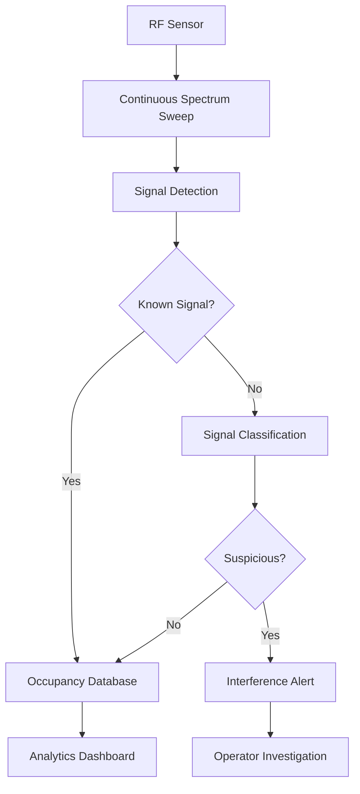

# Awesome-Spectrum-Management

## Top Spectrum Management Ecosystem

**Curated List of SaaS Products & Open-Source GitHub Projects**

*Focused on Radio Spectrum Planning, Frequency Management, RF Network Design, Propagation Modelling, Spectrum Monitoring, Interference Analysis & Spectrum Intelligence*

**Last updated: August 2026**

This repository tracks notable **SaaS/hosted platforms** and **open-source projects** for **Spectrum Management**. These tools help regulators, telecommunications operators, wireless ISPs, defence organizations, broadcasters, satellite operators, utilities and private-network operators plan, allocate, monitor, analyse and optimize use of the electromagnetic spectrum.

Spectrum-management platforms typically support **frequency planning, spectrum licensing, RF propagation modelling, interference analysis, coverage prediction, network planning, spectrum monitoring, field measurements, drive testing, spectrum occupancy analysis and regulatory coordination**.

**Examples** include LS telcom, Comsearch, Forsk Atoll, Infovista Planet, Transfinite Visualyse, ATDI ICS Telecom, Anritsu Spectrum Master, Keysight Nemo Outdoor and Teoco ASSET.

**Open-source emphasis**: This section is heavily expanded with open-source RF propagation engines, spectrum-analysis tools, software-defined radio platforms, wireless network planners, terrain-analysis systems, signal-processing frameworks, frequency-monitoring infrastructure and geospatial components.

The open-source ecosystem is particularly strong in **RF analysis, propagation modelling, SDR-based spectrum monitoring and custom wireless planning**, although there are fewer complete open-source replacements for national-scale regulatory spectrum licensing systems.

Contributions welcome! Open a PR to add/update entries. Keep descriptions factual and link to official sites or GitHub repositories.

## Table of Contents

* [SaaS/Hosted Platforms](#saashosted-platforms)

* [Open-Source GitHub Projects](#open-source-github-projects)

* [Additional Strong Open-Source Options](#additional-strong-open-source-options)

* [Frameworks for Building Custom Spectrum Management Systems](#frameworks-for-building-custom-spectrum-management-systems)

* [How to Contribute](#how-to-contribute)

* [Disclaimer](#disclaimer)

## SaaS/Hosted Platforms

* **[LS telcom](https://www.lstelcom.com/)**

  Major spectrum-management and RF engineering provider offering platforms for spectrum policy, licensing, frequency planning, technical analysis, spectrum monitoring and automated spectrum-management workflows. Its portfolio includes systems such as mySPECTRA, SPECTRAplan and SPECTRAemc.

* **[Comsearch](https://www.comsearch.com/)**

  Spectrum-management and wireless engineering provider offering frequency coordination, interference analysis, licensing support and RF engineering services.

* **[Forsk Atoll](https://www.forsk.com/atoll-overview)**

  Industry-leading multi-technology RF planning and optimization platform supporting 2G, 3G, 4G and 5G network design, coverage prediction, propagation modelling and network optimization.

* **[Infovista Planet](https://www.infovista.com/)**

  Radio network planning and optimization platform supporting mobile network design, propagation modelling, coverage planning and performance analysis.

* **[Transfinite Visualyse](https://www.transfinite.com/)**

  RF and spectrum-engineering platform focused on satellite, terrestrial and mixed wireless-system interference analysis, spectrum sharing and regulatory studies.

* **[ATDI ICS Telecom](https://www.atdi.com/)**

  RF planning and spectrum-management software platform supporting coverage analysis, frequency planning, interference analysis and wireless network engineering.

* **[Anritsu Spectrum Master](https://www.anritsu.com/)**

  Professional spectrum-analysis and field-test product family supporting RF measurements, interference detection, signal analysis and wireless network troubleshooting.

* **[Keysight Nemo Outdoor](https://www.keysight.com/)**

  Drive-test and wireless network measurement platform supporting field data collection, RF performance analysis and mobile-network optimization.

* **[TEOCO ASSET](https://www.teoco.com/)**

  Radio access network planning and optimization platform supporting RF engineering, capacity planning, coverage analysis and network-performance optimization.

* **[CloudRF](https://cloudrf.com/)**

  Cloud-based RF propagation and radio-network modelling platform supporting terrain analysis, coverage prediction and wireless network planning.

* **[Ranplan](https://www.ranplanwireless.com/)**

  Wireless network planning platform focused on indoor and outdoor radio planning, 5G, Wi-Fi and heterogeneous wireless networks.

* **[iBwave](https://www.ibwave.com/)**

  Professional RF design and planning platform widely used for indoor wireless networks, distributed antenna systems and private cellular deployments.

* **[Aviat WTM](https://www.aviatnetworks.com/)**

  Wireless network planning and optimization solutions for microwave and wireless infrastructure.

* **[Siterra](https://www.siterra.com/)**

  Telecom infrastructure and site-management platform that can support planning and lifecycle management of wireless network assets.

* **[Ericsson Network Intelligence](https://www.ericsson.com/)**

  Network planning, optimization and analytics technologies supporting mobile-network performance and radio resource optimization.

* **[Nokia AVA](https://www.nokia.com/networks/services/ava/)**

  Network analytics and automation platform supporting telecom network intelligence, operations and optimization.

* **[Airbus Spectrum Management](https://www.airbus.com/)**

  Defence and secure communications technologies supporting spectrum operations, electromagnetic analysis and mission-critical communications.

* **[Rohde & Schwarz Spectrum Monitoring](https://www.rohde-schwarz.com/)**

  Professional spectrum monitoring, direction finding and RF measurement solutions for regulators, operators and security organizations.

## Open-Source GitHub Projects

### RF Propagation & Radio Coverage Planning

* **[QRadioPredict](https://github.com/QDeltaSoft/qradiopredict)**

  Open-source VHF/UHF radio propagation and coverage prediction software supporting Longley-Rice/ITM and ITWOM models, terrain analysis, multiple frequencies and repeater-site planning.

* **[RF Signals / Bracket-Heat](https://github.com/thebracket/rf-signals)**

  Open-source RF planning system for wireless ISPs that includes Rust implementations of Longley-Rice/ITM, COST-HATA, ECC33, HATA, ITWOM, FSPL and other radio propagation algorithms, together with a self-hostable planning application.

* **[Community Network Interactive Planner](https://github.com/alirazaanis/Community-Network-Interactive-Planner)**

  Open-source cloud-based radio network planning and design tool supporting RF predictions, SPLAT-based propagation analysis, Longley-Rice/ITM, ITWOM, site planning and automatic frequency/PCI planning.

* **[SPLAT!](https://github.com/search?q=SPLAT+RF+propagation&type=repositories)**

  Open-source terrain-based RF propagation analysis ecosystem based on the Longley-Rice Irregular Terrain Model and widely used as a foundation for custom coverage and path-analysis systems.

* **[ITM / Longley-Rice Implementations](https://github.com/search?q=Longley-Rice+ITM&type=repositories)**

  Open-source implementations of the Irregular Terrain Model used for radio coverage prediction and terrain-based propagation analysis.

* **[ITWOM Implementations](https://github.com/search?q=ITWOM+propagation&type=repositories)**

  Community open-source implementations of the Irregular Terrain With Obstructions Model for advanced terrestrial propagation modelling.

* **[Splash](https://github.com/passcod/splash)**

  Experimental open-source RF propagation analysis project focused on modern implementations of terrain-based radio propagation algorithms.

* **[QRadioPredict Forks and Extensions](https://github.com/search?q=qRadioPredict&type=repositories)**

  Community forks and extensions of QRadioPredict for VHF/UHF coverage analysis and RF planning.

### Software Defined Radio & Spectrum Analysis

* **[GNU Radio](https://github.com/gnuradio/gnuradio)**

  One of the world's most important open-source software-defined radio frameworks, providing signal-processing blocks and tools for RF analysis, communications research, spectrum monitoring and custom SDR systems.

* **[SDRangel](https://github.com/f4exb/sdrangel)**

  Comprehensive open-source SDR application supporting real-time spectrum analysis, spectrograms, frequency scanning, signal measurements, RF heat maps, satellite tracking and numerous RF analysis functions.

* **[SigDigger](https://github.com/batchdrake/sigdigger)**

  Free open-source digital signal analyzer designed for analysing unknown RF signals, with SDR hardware support, real-time demodulation and analysis of FSK, PSK, ASK, analog video and other signals.

* **[Gqrx](https://github.com/gqrx-sdr/gqrx)**

  Popular open-source SDR receiver and spectrum-analysis application providing spectrum visualization, waterfall displays and real-time radio reception.

* **[CubicSDR](https://github.com/cjcliffe/CubicSDR)**

  Cross-platform open-source SDR application supporting multiple SDR devices and interactive spectrum visualization.

* **[SDR++](https://github.com/AlexandreRouma/SDRPlusPlus)**

  Modern cross-platform open-source SDR application supporting wideband spectrum viewing, modular signal processing and numerous SDR hardware platforms.

* **[OpenWebRX](https://github.com/jketterl/openwebrx)**

  Open-source multi-user web-based SDR receiver with frequency spectrum and waterfall displays, multiple SDR device support and remote signal analysis.

* **[OpenWebRX Extensions](https://github.com/eroyee/openwebrx_E)**

  Open-source SDR receiver extensions providing spectrum display, peak hold, time-series signal-level analysis and web-based monitoring capabilities.

* **[SDR# Community Tools](https://github.com/search?q=SDRSharp+plugins&type=repositories)**

  Community-developed plugins and tools extending SDR spectrum analysis and monitoring workflows.

### RF Spectrum Monitoring

* **[SDRangel](https://github.com/f4exb/sdrangel)**

  Can be used as an open-source spectrum-monitoring and signal-analysis platform with frequency scanning, spectrum measurements and remote-control capabilities.

* **[SigDigger](https://github.com/batchdrake/sigdigger)**

  Strong open-source option for signal identification and investigation of unknown RF transmissions.

* **[GNU Radio](https://github.com/gnuradio/gnuradio)**

  Flexible foundation for building automated spectrum-monitoring receivers, occupancy-analysis pipelines and custom signal classifiers.

* **[OpenWebRX](https://github.com/jketterl/openwebrx)**

  Useful for building remotely accessible SDR monitoring systems with browser-based spectrum visualization.

* **[rtl_power](https://github.com/keenerd/rtl-sdr)**

  Open-source spectrum-survey tooling for RTL-SDR hardware and long-duration RF power measurements.

* **[rtl-sdr](https://github.com/osmocom/rtl-sdr)**

  Major open-source software ecosystem for RTL-SDR receivers, providing low-cost access to RF spectrum capture and monitoring.

* **[SoapySDR](https://github.com/pothosware/SoapySDR)**

  Open-source SDR hardware abstraction layer enabling spectrum-analysis software to support many different radio devices.

* **[SatDump](https://github.com/SatDump/SatDump)**

  Open-source satellite signal processing software supporting SDR-based reception, spectrum processing and satellite communications analysis.

### Spectrum Occupancy & Signal Intelligence

* **[RF Explorer Community Tools](https://github.com/search?q=RF+Explorer+open+source&type=repositories)**

  Community software for collecting, visualizing and analysing spectrum data from RF measurement hardware.

* **[GNU Radio Spectrum Monitoring Projects](https://github.com/search?q=GNU+Radio+spectrum+monitoring&type=repositories)**

  Community open-source projects for building spectrum sensors, occupancy monitors and automated RF analysis pipelines.

* **[RTL-SDR Spectrum Monitoring Projects](https://github.com/search?q=RTL-SDR+spectrum+monitoring&type=repositories)**

  Open-source applications for automated RF monitoring and spectrum occupancy analysis using inexpensive SDR hardware.

* **[Open Spectrum Monitoring Projects](https://github.com/search?q=open+source+spectrum+monitoring+SDR&type=repositories)**

  Community projects for collecting, analysing and visualizing RF spectrum activity.

* **[RF Signal Classification Projects](https://github.com/search?q=RF+signal+classification+GNU+Radio&type=repositories)**

  Open-source machine-learning and DSP projects for identifying and classifying radio transmissions.

### Wireless Network Planning

* **[Community Network Interactive Planner](https://github.com/alirazaanis/Community-Network-Interactive-Planner)**

  One of the strongest GitHub-based examples of an open-source radio network planning application combining geospatial data, propagation models and automated network planning.

* **[RF Signals](https://github.com/thebracket/rf-signals)**

  Self-hostable wireless ISP planning system with terrain analysis and multiple propagation models.

* **[QRadioPredict](https://github.com/QDeltaSoft/qradiopredict)**

  Useful for point-to-point analysis, repeater planning and terrain-based VHF/UHF coverage studies.

* **[OpenCellID Tools](https://github.com/search?q=OpenCellID+network+planning&type=repositories)**

  Community projects using open cellular network data for network mapping and RF planning.

* **[OpenStreetMap](https://github.com/openstreetmap)**

  Critical open geospatial data ecosystem for building custom RF planning and coverage modelling systems.

* **[QGIS](https://github.com/qgis/QGIS)**

  Major open-source GIS platform that can be combined with RF propagation models, terrain data and spatial databases for advanced spectrum and network planning.

* **[GRASS GIS](https://github.com/OSGeo/grass)**

  Open-source geospatial analysis platform supporting terrain processing, raster analysis and spatial modelling.

### Terrain & Geospatial Infrastructure

* **[GDAL](https://github.com/OSGeo/gdal)**

  Essential open-source geospatial data-processing library for terrain, elevation, raster and vector data used in RF coverage modelling.

* **[QGIS](https://github.com/qgis/QGIS)**

  Open-source desktop GIS platform suitable for visualizing coverage maps, spectrum infrastructure and RF propagation results.

* **[GRASS GIS](https://github.com/OSGeo/grass)**

  Advanced open-source GIS and terrain-analysis platform useful for propagation and line-of-sight calculations.

* **[PostGIS](https://github.com/postgis/postgis)**

  Open-source spatial database extension for PostgreSQL suitable for storing spectrum licenses, transmitter locations, coverage areas and interference zones.

* **[OpenLayers](https://github.com/openlayers/openlayers)**

  Open-source web mapping framework useful for spectrum-management dashboards and coverage visualization.

* **[Leaflet](https://github.com/Leaflet/Leaflet)**

  Lightweight open-source web mapping library suitable for RF planning and spectrum visualization applications.

* **[Cesium](https://github.com/CesiumGS/cesium)**

  Open-source geospatial visualization platform useful for 3D terrain, propagation and infrastructure visualization.

### Cellular Network Measurement & Analysis

* **[Network Survey](https://github.com/christianrowlands/network-survey)**

  Open-source Android network surveying and cellular measurement application.

* **[Cellular Network Analysis Projects](https://github.com/search?q=open+source+cellular+network+analysis&type=repositories)**

  Community tools for analysing cellular networks, signal measurements and radio access technologies.

* **[Android Cellular Signal Tools](https://github.com/search?q=Android+cellular+signal+measurement+open+source&type=repositories)**

  Open-source projects for collecting and analysing cellular signal information.

* **[SnoopSnitch](https://github.com/snoopSnitch/snoopsnitch)**

  Open-source Android security and cellular network analysis project with capabilities relevant to radio environment monitoring.

### Antenna & RF Engineering

* **[OpenEMS](https://github.com/thliebig/openEMS)**

  Open-source electromagnetic field solver useful for antenna and RF component simulation.

* **[NEC2](https://github.com/search?q=NEC2+antenna+open+source&type=repositories)**

  Open-source implementations and tools based on Numerical Electromagnetics Code methods for antenna modelling.

* **[4NEC2](https://www.qsl.net/4nec2/)**

  Widely used antenna modelling environment based on NEC methods.

* **[OpenEMS Python Tools](https://github.com/search?q=openEMS+Python&type=repositories)**

  Community tools for automating electromagnetic and antenna simulations.

* **[scikit-rf](https://github.com/scikit-rf/scikit-rf)**

  Open-source Python RF and microwave engineering library supporting network analysis and RF measurement processing.

### Frequency Coordination & Regulatory Data Infrastructure

* **[Spectrum Management Open-Source Projects](https://github.com/search?q=open+source+spectrum+management&type=repositories)**

  Community projects exploring frequency management, spectrum allocation and RF coordination.

* **[Open Data Spectrum Projects](https://github.com/search?q=open+data+radio+spectrum&type=repositories)**

  Open-source projects for visualizing and analysing publicly available spectrum and frequency-allocation data.

* **[ITU Spectrum Data Tools](https://github.com/search?q=ITU+frequency+spectrum+open+source&type=repositories)**

  Community tools for processing and visualizing international frequency and spectrum data.

* **[PostgreSQL + PostGIS](https://github.com/postgis/postgis)**

  Strong open-source foundation for building frequency-license databases, geographic coordination systems and transmitter registries.

### Spectrum Data Processing & Analytics

* **[Python](https://github.com/python/cpython)**

  Major open-source programming ecosystem with extensive libraries for scientific computing and RF data analysis.

* **[NumPy](https://github.com/numpy/numpy)**

  Fundamental open-source numerical computing library for spectrum and signal analysis.

* **[SciPy](https://github.com/scipy/scipy)**

  Scientific computing library providing signal-processing, optimization and statistical analysis tools.

* **[SciPy Signal Processing](https://docs.scipy.org/doc/scipy/reference/signal.html)**

  Signal-processing toolkit useful for spectral analysis, filtering and RF measurement processing.

* **[Pandas](https://github.com/pandas-dev/pandas)**

  Open-source data analysis framework suitable for processing spectrum occupancy and measurement datasets.

* **[Apache Spark](https://github.com/apache/spark)**

  Open-source distributed data-processing platform useful for large-scale spectrum measurement and monitoring datasets.

* **[ClickHouse](https://github.com/ClickHouse/ClickHouse)**

  High-performance open-source analytical database suitable for large RF measurement and spectrum-occupancy datasets.

### Machine Learning for Spectrum Analysis

* **[PyTorch](https://github.com/pytorch/pytorch)**

  Open-source machine-learning framework widely used for RF signal classification and modulation recognition research.

* **[TensorFlow](https://github.com/tensorflow/tensorflow)**

  Open-source machine-learning framework suitable for RF signal classification and spectrum intelligence systems.

* **[RadioML Projects](https://github.com/search?q=RadioML+signal+classification&type=repositories)**

  Community projects and research implementations for automatic modulation recognition and RF signal classification.

* **[DeepSig Community Projects](https://github.com/search?q=deep+learning+radio+modulation+classification&type=repositories)**

  Open-source research tools for machine-learning-based radio signal recognition.

## Additional Strong Open-Source Options

* **RF propagation modelling**: QRadioPredict, SPLAT!, Longley-Rice/ITM implementations, ITWOM, RF Signals and Community Network Interactive Planner.

* **Software-defined radio**: GNU Radio, SDRangel, Gqrx, CubicSDR and SDR++.

* **Signal investigation**: SigDigger and GNU Radio.

* **Web-based spectrum monitoring**: OpenWebRX.

* **Low-cost spectrum sensors**: RTL-SDR and SoapySDR-compatible hardware.

* **Terrain and GIS analysis**: QGIS, GRASS GIS, GDAL and PostGIS.

* **3D geospatial visualization**: Cesium.

* **Antenna and RF engineering**: OpenEMS, NEC2 tools and scikit-rf.

* **Scientific RF analysis**: Python, NumPy and SciPy.

* **Large-scale spectrum analytics**: Apache Spark and ClickHouse.

* **Machine-learning spectrum intelligence**: PyTorch, TensorFlow and RadioML-based projects.

* **Mapping infrastructure**: OpenStreetMap, Leaflet and OpenLayers.

* Many community projects support **RF interference detection, signal classification, spectrum occupancy measurement, cellular signal collection, SDR scanning and automated radio monitoring**.

## Frameworks for Building Custom Spectrum Management Systems

A powerful open-source Spectrum Management Platform can combine:

**Spectrum Registry & Frequency Database**

**PostgreSQL + PostGIS**

↓

**RF Propagation Engine**

**Longley-Rice / ITM + ITWOM + RF Signals**

↓

**Geospatial Planning**

**QGIS + GDAL + OpenStreetMap**

↓

**RF Monitoring**

**RTL-SDR + GNU Radio + SoapySDR**

↓

**Signal Analysis**

**SDRangel + SigDigger**

↓

**Spectrum Occupancy Data**

**Time-Series Database**

↓

**Analytics**

**Python + Pandas + SciPy + ClickHouse**

↓

**Visualization**

**Grafana + Leaflet / OpenLayers**

↓

**Automation**

**Node-RED / n8n**

↓

**AI Signal Classification**

**PyTorch / TensorFlow**

A particularly strong self-hosted architecture could be:

**PostgreSQL + PostGIS + QGIS + RF Signals + GNU Radio + RTL-SDR + SDRangel + SigDigger + ClickHouse + Grafana + Leaflet**

This architecture can provide functionality similar to a combination of:

* Spectrum Inventory System

* Frequency Coordination Database

* RF Planning Platform

* Radio Coverage Prediction System

* Spectrum Monitoring Network

* SDR-Based Signal Intelligence Platform

* Spectrum Occupancy Analytics System

* Interference Detection Platform

* Wireless Network Planning Tool

* RF Measurement Data Lake

* Geospatial Spectrum Dashboard

* AI-Assisted Signal Classification System

## Recommended Open-Source Spectrum Management Stack

For organizations seeking a self-hosted alternative to integrated commercial spectrum-management and RF planning platforms, a practical architecture could be:

**Frequency Registry**

`PostgreSQL + PostGIS`

↓

**Propagation Modelling**

`QRadioPredict / RF Signals / Longley-Rice`

↓

**GIS & Terrain**

`QGIS + GDAL + GRASS GIS`

↓

**Spectrum Sensors**

`RTL-SDR / SoapySDR-Compatible SDRs`

↓

**Signal Processing**

`GNU Radio`

↓

**Interactive Analysis**

`SDRangel + SigDigger`

↓

**Spectrum Data Storage**

`ClickHouse / PostgreSQL`

↓

**Monitoring Dashboards**

`Grafana`

↓

**Mapping**

`OpenLayers / Leaflet`

↓

**Workflow Automation**

`Node-RED / n8n`

↓

**AI Signal Classification**

`PyTorch / TensorFlow`

## Spectrum Management Data Model

A typical Spectrum Management Platform may include:

* Frequency Band

* Frequency Assignment

* Channel

* License

* Licensee

* Spectrum Block

* Service Type

* Transmitter

* Receiver

* Antenna

* Antenna Pattern

* Site

* Base Station

* Repeater

* Satellite Station

* Earth Station

* Geographic Area

* Coverage Area

* Coordination Zone

* Protection Zone

* Propagation Model

* Terrain Dataset

* Frequency Plan

* Interference Case

* Measurement

* Spectrum Sweep

* Occupancy Record

* Signal

* Modulation Type

* Bandwidth

* Power Level

* Noise Floor

* Alert

* Monitoring Station

* Device

* Regulatory Authority

* Operator

* Workflow

* Audit Record

## Spectrum Management Lifecycle

`Spectrum Policy → Band Planning → Frequency Allocation → Licensing → Technical Coordination → Network Planning → Deployment → Monitoring → Interference Management → Optimization → Reallocation`

A modern spectrum-management platform should maintain traceability between frequency assignments, licenses, transmitter locations, technical parameters, monitoring data and interference cases.

## RF Planning Workflow

## Spectrum Monitoring Workflow

## Spectrum Management Architecture

## Spectrum Monitoring Network Architecture

## Spectrum Occupancy Analytics

Useful analytics include:

* Spectrum occupancy percentage

* Band utilization

* Frequency availability

* Noise floor

* Signal power distribution

* Interference incidents

* Unauthorized transmissions

* Channel congestion

* Geographic spectrum usage

* Time-of-day utilization

* Bandwidth consumption

* Monitoring-station availability

* Signal classification confidence

* Frequency assignment density

* License utilization

* Interference resolution time

* RF sensor coverage

* Spectrum heat maps

## AI-Assisted Spectrum Management

Potential AI-assisted capabilities include:

* Automatic signal classification

* Modulation recognition

* Interference detection

* Anomaly detection

* Spectrum occupancy prediction

* Unauthorized transmission detection

* Frequency congestion forecasting

* RF pattern recognition

* Automatic event clustering

* Interference root-cause analysis

* RF monitoring prioritization

* Spectrum allocation recommendations

A self-hosted architecture could combine:

`RF Sensors → SDR Capture → GNU Radio → Signal Database → Feature Extraction → PyTorch → Signal Classification → Spectrum Dashboard`

AI-based spectrum systems should be validated carefully because signal propagation, interference and modulation characteristics can vary significantly by environment, hardware and operating conditions.

## Automated Spectrum Monitoring Workflow

## Regulatory Spectrum Management

Regulatory and national spectrum-management systems may additionally require:

* Frequency licensing workflows

* Spectrum auction records

* International coordination

* Cross-border interference analysis

* ITU-related data processing

* National frequency allocation tables

* License fee management

* Regulatory reporting

* Audit trails

* Public frequency registries

* Protected service coordination

* Emergency-service spectrum protection

* Military spectrum coordination

* Satellite frequency coordination

Open-source components can provide much of the underlying infrastructure, although national-scale regulatory workflows often require substantial jurisdiction-specific customization.

## How to Contribute

1. Fork the repo.

2. Add/edit entries in `README.md` following the existing format.

3. Include: name, link, 1–2 sentence description and whether the project is SaaS/hosted or open-source.

4. Clearly identify whether an open-source project provides a complete spectrum-management platform or a component such as RF propagation, SDR monitoring, GIS, signal processing or analytics.

5. Prefer actively maintained projects with clear licenses and documentation.

6. Include deployment or self-hosting information where available.

7. Submit a PR with a short explanation.

Star the repo if you find it useful!

## Disclaimer

* This is a **community-curated** list — not exhaustive and not an endorsement.

* Commercial and open-source tools vary significantly in accuracy, maturity, regulatory acceptance and production readiness.

* Many open-source projects listed here are building blocks for custom spectrum-management systems rather than complete replacements for enterprise or national regulatory platforms.

* RF propagation predictions depend heavily on terrain, clutter, atmospheric conditions, antenna characteristics and model assumptions.

* Frequency coordination and spectrum licensing must comply with applicable national and international regulations.

* Spectrum monitoring and signal interception activities may be subject to communications, privacy, surveillance and licensing laws.

* SDR hardware capabilities vary significantly in sensitivity, bandwidth, dynamic range and frequency accuracy.

* Self-hosted deployments require appropriate cybersecurity, access control, audit logging, monitoring and data protection.

* Always independently validate RF engineering results before making operational, regulatory or safety-critical decisions.

---

**Made for spectrum regulators, RF engineers, telecommunications operators, wireless ISPs, private-network teams, broadcasters, satellite operators, SDR enthusiasts, researchers and developers building open spectrum infrastructure.**

Let's make spectrum management more **open, data-driven, interoperable, measurable and accessible**.
