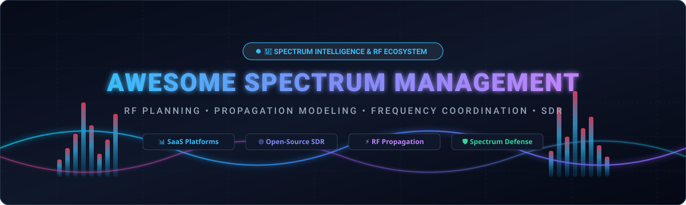
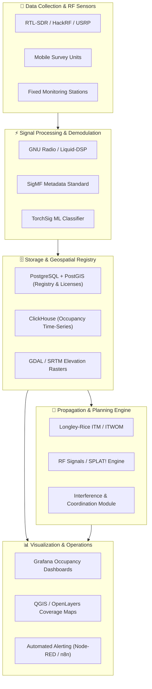
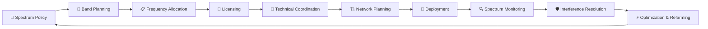

  

  
  
  
  
  
  
  

---

# 📡 Awesome Spectrum Management

> A comprehensive, community-curated index of **Radio Frequency (RF) Spectrum Management**, **SDR Spectrum Monitoring**, **Frequency Coordination & Licensing**, **Propagation Modeling (Longley-Rice / ITM / ITWOM)**, **5G NR / LTE Network Planning**, and **Spectrum Intelligence** software platforms.

**Last updated: August 2026**

This ecosystem directory covers production **SaaS/hosted platforms**, commercial toolchains, and **open-source GitHub projects** designed for national regulators (FCC, ITU, CEPT, Ofcom), telecommunications operators, wireless ISPs (WISPs), defense organizations, satellite operators, utilities, and private 4G/5G/CBRS network teams.

---

## 📑 Table of Contents

* [📊 SaaS & Hosted Platforms](#-saashosted-platforms)
* [💻 Open-Source GitHub Projects](#-open-source-github-projects)
  * [📻 Software Defined Radio & Spectrum Analysis](#-software-defined-radio--spectrum-analysis)
  * [⚡ RF Propagation & Radio Coverage Planning](#-rf-propagation--radio-coverage-planning)
  * [🛰️ RF Spectrum Monitoring & Satellite Intelligence](#️-rf-spectrum-monitoring--satellite-intelligence)
  * [📐 Antenna & Electromagnetic Simulation](#-antenna--electromagnetic-simulation)
  * [🗺️ Terrain & Geospatial Infrastructure](#️-terrain--geospatial-infrastructure)
  * [📊 Spectrum Data Processing & Analytics](#-spectrum-data-processing--analytics)
  * [🤖 Machine Learning & AI Signal Intelligence](#-machine-learning--ai-signal-intelligence)
* [🏗️ Recommended Open-Source Spectrum Management Architecture](#️-recommended-open-source-spectrum-management-architecture)
* [🗄️ Spectrum Management Data Model](#️-spectrum-management-data-model)
* [🔄 Spectrum Management Lifecycle](#-spectrum-management-lifecycle)
* [📈 Star History](#-star-history)
* [🤝 How to Contribute](#-how-to-contribute)
* [⚖️ Disclaimer](#️-disclaimer)

---

## 📊 SaaS/Hosted Platforms

> 📈 **Estimated Market Size & Industry Dynamics:** The global Spectrum Management and RF Engineering Software market is valued at **~$2.1 Billion in 2026** (projected to reach **$4.8 Billion by 2033** growing at an **11.8% CAGR**). The market is **moderately fragmented**—national regulatory authorities and tier-1 mobile operators contract with concentrated enterprise giants (Airbus, Ericsson, Nokia, Keysight, Rohde & Schwarz), while wireless ISPs, private cellular (5G/CBRS) networks, indoor DAS, and frequency coordinators utilize a competitive ecosystem of specialized engineering vendors and agile cloud-native SaaS platforms.

| Platform / Company | Company Scale (Revenue / Valuation) | Description & Core Capabilities | Pricing (Starting Tiers) | Free Tier / Free Trial Limits |
| :--- | :--- | :--- | :--- | :--- |
| **[Airbus Spectrum Management](https://www.airbus.com/)** | **~$70 Billion** (€65.4B Revenue / ~$120B Market Cap) | Mission-critical spectrum management and electromagnetic situational awareness solutions for defense, security, and public safety agencies. | Starting from **€25,000–€100,000+** for specialized governmental and defense spectrum planning systems and electronic warfare modules | **No free-forever plan**; Government and defense consultation with controlled capability demonstrations via official defense procurement channels. |
| **[Ericsson Network Intelligence](https://www.ericsson.com/)** | **~$24.5 Billion** (SEK 263B Revenue / ~$25B Market Cap) | AI-driven cognitive software and RAN analytics platform supporting automated radio resource optimization and network performance intelligence. | Starting from **$15,000–$50,000/year** per network cluster subscription or outcome-based managed service agreement | **No free-forever plan**; Guided operator Proof-of-Concept (PoC) and scoped pilot trials available for CSPs to measure energy/throughput KPIs prior to rollout. |
| **[Nokia AVA](https://www.nokia.com/networks/services/ava/)** | **~$24.0 Billion** (€22.2B Revenue / ~$24B Market Cap) | Telecom AI analytics, virtualization, and automation SaaS platform supporting radio efficiency, energy optimization, and network operations. | Starting from **$10,000–$30,000/year** SaaS subscription or pay-on-outcomes model tied to verified energy and operational savings | **No free-forever plan**; Request-based live workflow demonstrations and capability assessment consultations arranged via Nokia sales. |
| **[Keysight Nemo Outdoor](https://www.keysight.com/)** | **~$5.0 Billion** ($4.98B Revenue / ~$28B Market Cap) | Drive-test, field data collection, and RF measurement platform supporting 5G NR/LTE benchmarking, scanner support, and Nemo Cloud analytics. | Starting from **$5,000–$12,000/year per test seat** depending on supported technologies, test terminals, and scanner module options | **No free-forever plan**; Request-based budgetary evaluation, live product walkthrough, and temporary loaner/trial test licenses via Keysight sales. |
| **[Rohde & Schwarz Spectrum Monitoring](https://www.rohde-schwarz.com/)** | **~$3.2 Billion** (€2.93B Revenue / Private) | ITU-compliant spectrum monitoring, signal interception, direction finding, and radiomonitoring software suites (R&S ARGUS & RAMON). | Core ARGUS workstation software licenses starting from **€10,000–€35,000** (modular software packages excluding sensor hardware) | **30-day free trial** for specific instrument software options; request-based live system demonstration and loaner evaluation hardware for regulatory authorities. |
| **[Anritsu Spectrum Master](https://www.anritsu.com/)** | **~$750 Million** (¥110B Revenue / ~$1.1B Market Cap) | Spectrum-analysis and field-test ecosystem providing RF measurements, interference hunting, signal analysis, and remote monitoring (Vision MX280001A). | Utility tools **$0 (bundled)** with instrument purchases; Vision remote spectrum monitoring software options start from **$2,500** per instrument | **Free-forever plan**: Full PC utility suite (**Master Software Tools**, Line Sweep Tools, easyTest, easyMap via Anritsu Software Tool Box) free to download and use with Anritsu trace data. |
| **[Aviat WTM / Design](https://www.aviatnetworks.com/)** | **~$410 Million** ($410M Revenue / NASDAQ: AVNW) | Microwave link planning and wireless transport management tools supporting point-to-point path design and WTM radio capacity management. | Aviat Design web planning tool is **$0 (100% Free)**; WTM radio link capacity licenses start from **$500–$2,000** per link | **Free-forever plan**: Full cloud-based link engineering and microwave path calculations available at **$0** with unlimited standard link designs upon free AviatCloud registration. |
| **[Siterra](https://www.siterra.com/)** | **~$350 Million** (Accruent / Fortive ~$25B Market Cap) | Telecom infrastructure, site management, and project tracking platform supporting antenna sites and wireless asset lifecycle workflows. | Starting from **$300–$600/month** (typically billed annually at **$3,600–$7,200/year** based on user seats and site portfolio count) | **No free-forever plan**; Request-based guided interactive demo and customized pilot evaluation through Accruent sales representatives. |
| **[Infovista Planet](https://www.infovista.com/)** | **~$200 Million** (Private Equity / Seven2) | Radio network planning and optimization platform (VistaPlan Go / Planet Cloud) supporting mobile network design, 5G NR propagation modeling, and coverage analytics. | Starting from **$3,000–$8,000/year per user license** depending on selected technology modules; enterprise multi-seat plans on quotation | **No free-forever plan**; Request-based personalized interactive demo session and on-demand Demo Gallery workflow access. |
| **[TEOCO ASSET](https://www.teoco.com/)** | **~$120 Million** (Private Equity / TA Associates) | Radio access network planning and optimization platform supporting multi-technology RF engineering, capacity planning, and coverage prediction. | Starting from **$10,000–$25,000/year per operator seat** based on network scale, technology tiers (5G/4G/IoT), and optimization modules | **No free-forever plan**; Request-based customized proof-of-concept (PoC) and guided live product demonstration for mobile network operators. |
| **[iBwave](https://www.ibwave.com/)** | **~$60 Million** (Corning Inc. Subsidiary / ~$38B Cap) | In-building and private cellular network RF design and planning platform widely used for DAS, small cells, and Wi-Fi deployments. | **$513 for a 30-day subscription** (Private Networks Wi-Fi) and **$685 for a 30-day subscription** (Mobile Planner); iBwave Viewer+ at **$1,424/year** | **14 to 15-day free trial**: 15-day free trial for Mobile Planner, Mobile Survey, and Wi-Fi Mobile; 14-day trial for Express; 30-day trial for Unity (export/project size capped). |
| **[LS telcom](https://www.lstelcom.com/)** | **~$50 Million** (€42M Revenue / Frankfurt: LSX) | Enterprise spectrum-management and RF engineering suite (mySPECTRA, SPECTRAplan, SPECTRAemc) covering policy, licensing, frequency coordination, and automated monitoring workflows. | Modular software licenses starting from **€5,000–€15,000/year** (enterprise system rollouts based on formal regulatory tender/project specifications) | **No free-forever plan**; Request-based guided evaluation demo available with sample national spectrum databases upon sales consultation. |
| **[Forsk Atoll](https://www.forsk.com/atoll-overview)** | **~$35 Million** (Private Enterprise) | Multi-technology RF planning and optimization platform supporting 2G, 3G, 4G, and 5G network design, propagation modeling, and RAN optimization. | Perpetual/annual workstation licenses starting from **€5,000–€10,000** per seat (annual maintenance support from ~€1,500/year; training from €1,500) | **No free-forever plan**; Request-based guided interactive product demo with sample operator network datasets via Forsk representatives. |
| **[Comsearch](https://www.comsearch.com/)** | **~$30 Million** (CommScope Division / ~$1B Cap) | Spectrum management and wireless engineering service providing microwave frequency coordination, FCC licensing, interference analysis, and spectrum protection. | Starting at **$150–$350 per frequency path coordination** / licensing filing fee; annual enterprise engineering retainer plans available | **No free-forever plan**; Free initial telecom consultation and baseline interference evaluation quote upon request. |
| **[ATDI ICS Telecom / HTZ](https://www.atdi.com/)** | **~$25 Million** (Private Enterprise) | RF planning, spectrum management, and tactical communications suite (HTZ Communications / Warfare) supporting coverage analysis and frequency assignments. | Starting from **€4,500–€9,000/year** for commercial HTZ licenses; academic license packs starting at **€2,000** (5 users) | **No free-forever plan**; **14 to 30-day request-based trial license** (feature/dataset restricted) and no-obligation live evaluation demo available. |
| **[Ranplan](https://www.ranplanwireless.com/)** | **~$8 Million** (SEK 85M Revenue / Nasdaq First North) | Wireless network planning platform focused on indoor, outdoor, and heterogeneous 5G, Wi-Fi, and private network RF design. | FlexiLease short-term leasing starting from **£300–£800/month**; perpetual FlexiBuy and InfinityPlus licenses starting from **£6,000** | **Free-forever plan**: **Ranplan Viewer** is completely free to download and inspect 2D/3D network designs; project-based trial access available upon request. |
| **[Transfinite Visualyse](https://www.transfinite.com/)** | **~$5 Million** (Private Enterprise) | RF and spectrum-engineering platform for satellite, terrestrial, and mixed wireless systems interference analysis, spectrum sharing, and ITU coordination. | Starting from **£2,500–£5,000/year** for entry desktop modeling licenses; flexible pay-per-use and project modules also available | **Free demo version** of Visualyse Professional available (includes tutorial datasets for propagation and antenna modeling) + free standalone **VisTools** utilities. |
| **[CloudRF](https://cloudrf.com/)** | **~$2 Million** (Private Bootstrapped) | Cloud-based RF propagation modeling and radio network coverage prediction API/web platform with global terrain and clutter datasets. | Paid plans start at **£40/month** (or £45/mo pay-as-you-go; £405/year Bronze tier); Silver at **£80/mo**; Gold at **£144/mo**; Platinum at **£288/mo** | **Free-forever plan**: Includes **10 km radius limit**, **50 API requests/month**, 4 MP resolution, and frequency support restricted to <1 GHz. |

---

## 💻 Open-Source GitHub Projects

### 📻 Software Defined Radio & Spectrum Analysis

* **[GNU Radio](https://github.com/gnuradio/gnuradio)** 
  The premier open-source software development toolkit that provides signal processing blocks to implement software radios, RF spectrum monitoring systems, and digital signal analysis pipelines.

* **[HackRF](https://github.com/greatscottgadgets/hackrf)** 
  Low-cost, open-source Software Defined Radio platform capable of transmitting and receiving radio signals from 1 MHz to 6 GHz.

* **[Universal Radio Hacker (URH)](https://github.com/jopohl/urh)** 
  Complete suite for wireless protocol investigation, automated reverse engineering of unknown RF signals, and packet demodulation.

* **[rtl-sdr](https://github.com/osmocom/rtl-sdr)** 
  Core driver and command-line utility suite turning Realtek RTL2832U DVB dongles into versatile, low-cost wideband RF spectrum receivers.

* **[SDR++](https://github.com/AlexandreRouma/SDRPlusPlus)** 
  Cross-platform, high-performance SDR receiver application with modular signal decoders, wideband waterfall displays, and broad hardware support.

* **[OpenWebRX](https://github.com/jketterl/openwebrx)** 
  Multi-user web-based SDR receiver application enabling remote spectrum exploration, waterfall monitoring, and audio demodulation directly in a web browser.

* **[SDRangel](https://github.com/f4exb/sdrangel)** 
  Advanced SDR receiver and transmitter frontend with multichannel demodulators, 2D/3D spectrograms, satellite tracking, and RF spectrum measurement capabilities.

* **[Gqrx](https://github.com/gqrx-sdr/gqrx)** 
  Popular open-source software-defined radio receiver powered by GNU Radio and the Qt GUI toolkit, supporting FFT spectrum analysis and recording.

* **[UHD / USRP Hardware Driver](https://github.com/EttusResearch/uhd)** 
  The official host driver and API library for all Ettus Research USRP™ Software Defined Radio products.

* **[CubicSDR](https://github.com/cjcliffe/CubicSDR)** 
  Cross-platform Software Defined Radio application built on Liquid-DSP and OpenGL for smooth, interactive spectrum visualization.

* **[Inspectrum](https://github.com/miek/inspectrum)** 
  Radio frequency signal analysis tool for visual analysis of captured IQ files, spectrogram inspection, and symbol extraction.

* **[bladeRF](https://github.com/Nuand/bladeRF)** 
  Host libraries, drivers, FPGA source code, and firmware for Nuand bladeRF USB 3.0 Software Defined Radios.

* **[liquid-dsp](https://github.com/jgaeddert/liquid-dsp)** 
  Digital signal processing library written in C for software-defined radios, providing filters, FFTs, modulation, error-correction, and synchronization blocks.

* **[SoapySDR](https://github.com/pothosware/SoapySDR)** 
  Vendor-neutral SDR hardware abstraction layer and C/C++/Python library allowing software applications to interface transparently with any SDR device.

* **[SigDigger](https://github.com/batchdrake/sigdigger)** 
  Interactive digital signal analyzer designed for investigating unknown RF transmissions with real-time demodulation of FSK, PSK, ASK, and video carriers.

* **[pyrtlsdr](https://github.com/roger-/pyrtlsdr)** 
  Python wrapper for librtlsdr, enabling rapid prototyping of SDR spectrum analysis scripts, power sweep measurements, and IQ sampling in Python.

* **[csdr](https://github.com/simonyiszk/csdr)** 
  Command-line tool and DSP library for processing software-defined radio IQ streams with high throughput on embedded platforms.

* **[PothosCore](https://github.com/pothosware/PothosCore)** 
  Dataflow framework designed for developing topology-based streaming applications, signal processing graphs, and SDR pipelines.

* **[OpenWebRX Extended](https://github.com/eroyee/openwebrx_E)** 
  Community fork of OpenWebRX featuring extended waterfall customization, multi-receiver peak holding, and time-series RF monitoring.

---

### ⚡ RF Propagation & Radio Coverage Planning

* **[QGIS](https://github.com/qgis/QGIS)** 
  Enterprise-grade desktop GIS software capable of combining DEM elevation rasters, clutter data, antenna radiation patterns, and propagation models for custom RF network design.

* **[GDAL](https://github.com/OSGeo/gdal)** 
  Translator library for raster and vector geospatial data formats, fundamental for processing digital elevation models (SRTM, USGS, LiDAR) in RF path profiles.

* **[SPLAT!](https://github.com/Alor/splat)** 
  Terrain-based RF propagation and line-of-sight analysis tool using the Longley-Rice Irregular Terrain Model (ITM) for VHF/UHF radio link design.

* **[QRadioPredict](https://github.com/QDeltaSoft/qradiopredict)** 
  VHF/UHF radio propagation and coverage prediction software utilizing Longley-Rice and ITWOM models with elevation map integration.

* **[RF Signals / Bracket-Heat](https://github.com/thebracket/rf-signals)** 
  Open-source WISP radio planning tool written in Rust featuring high-performance implementations of Longley-Rice/ITM, COST-Hata, ECC33, ITWOM, and FSPL algorithms.

* **[Community Network Interactive Planner](https://github.com/alirazaanis/Community-Network-Interactive-Planner)** 
  Cloud-based radio network planning platform supporting Longley-Rice and ITWOM propagation models, automated PCI planning, and site optimization.

* **[Splash](https://github.com/passcod/splash)** 
  Modern terrain-based RF propagation engine and library designed for high-performance line-of-sight and wireless pathloss calculations.

* **[ITM (Longley-Rice Python)](https://github.com/NTIA/itm)** 
  Reference implementations of the NTIA / ITS Irregular Terrain Model (ITM) point-to-point and area-mode propagation algorithms.

---

### 🛰️ RF Spectrum Monitoring & Satellite Intelligence

* **[SatDump](https://github.com/SatDump/SatDump)** 
  Multi-system satellite telemetry decoding and spectrum processing software supporting hundreds of weather, earth-observation, and communication satellites.

* **[SigMF / Signal Metadata Format](https://github.com/sigmf/SigMF)** 
  Open standard specifications and reference tools for recording and exchanging RF recordings, spectrum captures, and signal annotations.

* **[Network Survey](https://github.com/christianrowlands/network-survey)** 
  Android application for cellular (5G/LTE/UMTS/GSM), Wi-Fi, GNSS, and Bluetooth survey logging, spectrum mapping, and geo-tagged coverage collection.

* **[rtl_power / Keenerd rtl-sdr](https://github.com/keenerd/rtl-sdr)** 
  Optimized wideband spectrum sweep and power measurement utilities for long-term RF band occupancy analysis with low-cost SDR hardware.

* **[SnoopSnitch](https://github.com/snoopSnitch/snoopsnitch)** 
  Android mobile network security and radio-environment analysis app that detects IMSI catchers, SS7 attacks, and silent SMS tracking.

---

### 📐 Antenna & Electromagnetic Simulation

* **[scikit-rf](https://github.com/scikit-rf/scikit-rf)** 
  Python package for RF and microwave engineering, Touchstone S-parameter file processing, calibration, vector network analysis, and circuit simulation.

* **[VOLK](https://github.com/gnuradio/volk)** 
  Vector-Optimized Library of Kernels providing SIMD-accelerated DSP routines for high-speed real-time RF signal processing.

* **[openEMS](https://github.com/thliebig/openEMS)** 
  Open-source Electromagnetic Field Solver using the Finite-Difference Time-Domain (FDTD) method for antenna modeling and RF filter simulations.

* **[necpp](https://github.com/tmolteno/necpp)** 
  C++ antenna simulation library and Python bindings based on the Numerical Electromagnetics Code (NEC-2) method of moments.

---

### 🗺️ Terrain & Geospatial Infrastructure

* **[Cesium](https://github.com/CesiumGS/cesium)** 
  Open 3D geospatial platform for visualizing terrain, buildings, 3D antenna radiation lobes, and line-of-sight wireless paths in the browser.

* **[OpenLayers](https://github.com/openlayers/openlayers)** 
  High-performance open-source web mapping library for displaying RF heatmaps, spectrum license polygons, and transmitter tower overlays.

* **[PostGIS](https://github.com/postgis/postgis)** 
  Spatial database extension for PostgreSQL, ideal for housing frequency allocation tables, licensing boundaries, and transmitter coordinates.

* **[GRASS GIS](https://github.com/OSGeo/grass)** 
  Modular Geographic Information System engine for raster terrain processing, viewshed analysis, and RF line-of-sight computations.

---

### 📊 Spectrum Data Processing & Analytics

* **[Pandas](https://github.com/pandas-dev/pandas)** 
  Fast, powerful data manipulation framework for processing time-series RF occupancy sweeps, channel utilization, and spectrum logs.

* **[Apache Spark](https://github.com/apache/spark)** 
  Unified analytics engine for large-scale distributed RF sensor data lakes, countrywide spectrum telemetry, and monitoring network processing.

* **[ClickHouse](https://github.com/ClickHouse/ClickHouse)** 
  Ultra-fast column-oriented database management system for querying billions of spectrum monitoring samples and historical occupancy events in real time.

* **[NumPy](https://github.com/numpy/numpy)** 
  Fundamental scientific package for N-dimensional array processing, FFTs, and complex IQ numerical operations.

* **[SciPy](https://github.com/scipy/scipy)** 
  Fundamental algorithms for scientific computing, featuring `scipy.signal` for spectral density estimations, spectrograms, and filter design.

---

### 🤖 Machine Learning & AI Signal Intelligence

* **[TensorFlow](https://github.com/tensorflow/tensorflow)** 
  End-to-end machine learning platform used for training deep neural networks on RF modulation recognition and spectrum anomaly detection.

* **[PyTorch](https://github.com/pytorch/pytorch)** 
  Leading deep learning framework for radio frequency machine learning (RFML), automatic modulation classification (AMC), and transmitter fingerprinting.

* **[TorchSig](https://github.com/TorchSig/torchsig)** 
  PyTorch-based signal processing machine learning toolkit for RF dataset generation, signal augmentation, and wireless transmission classification.

---

## 🏗️ Recommended Open-Source Spectrum Management Architecture

---

## 🗄️ Spectrum Management Data Model

A comprehensive spectrum management framework encompasses the following relational entities:

* 📡 **Frequency Bands & Blocks:** Lower/upper frequency boundaries, duplex spacing, regulatory channelization plans.
* 📜 **Spectrum Licenses & Authorizations:** Licensee details, validity period, geographical scope, authorized EIRP limits, emission masks.
* 📍 **Transmitter & Receiver Sites:** Geo-coordinates, antenna height above ground (AGL), terrain elevation (AMSL), feeder loss.
* 🎯 **Antenna Patterns:** Horizontal and vertical 3D radiation patterns, polarization, electrical downtilt, azimuth.
* 🗺️ **Coordination & Protection Zones:** Cross-border international coordination contours, exclusion zones, co-channel/adjacent-channel thresholds.
* 📈 **Occupancy & Measurement Sweeps:** Timestamped power spectral density (PSD), spectrogram sweeps, noise floor tracking.
* ⚠️ **Interference Cases & Alerts:** Incident logging, bearing vectors from direction finders, triangulation resolution status.

---

## 🔄 Spectrum Management Lifecycle

---

## 📈 Star History

---

## 🤝 How to Contribute

1. 🍴 Fork the repository.
2. 📝 Add or update entries in `README.md` maintaining the table formatting and star count sorting.
3. 🔗 Include accurate official links, descriptions, and verified license/pricing details.
4. 🚀 Submit a Pull Request (PR) with a brief summary of the changes.

---

## ⚖️ Disclaimer

* This is a **community-curated index** — provided for informational and educational purposes without endorsement.
* Commercial software pricing, product availability, and license tiers are subject to change by their respective vendors.
* Radio transmission, frequency coordination, and spectrum monitoring activities must strictly comply with national regulatory frameworks (e.g., FCC, ITU-R, CEPT) and local communications laws.

---

  <b>Made with ❤️ for Spectrum Regulators, RF Engineers, Telecom Operators, WISPs, and SDR Researchers.</b>

